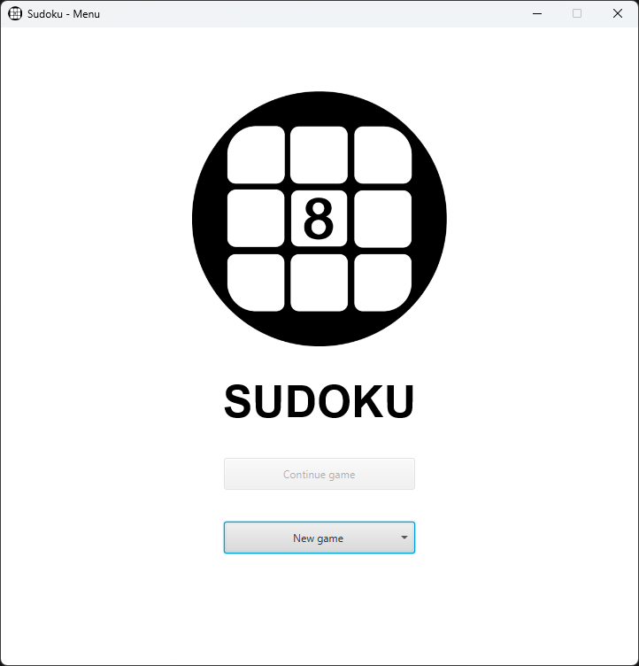
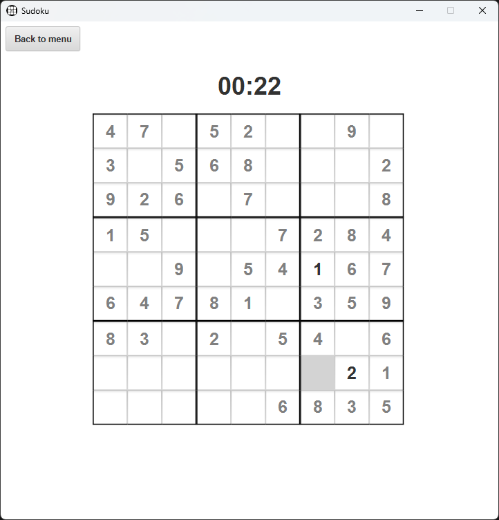
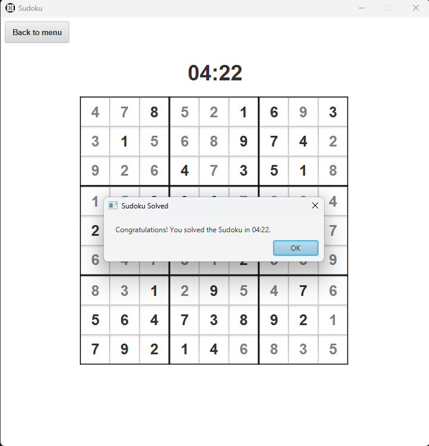

# Sudoku

**Name**: Baják Levente Imre

**Neptun**: B5FWY3

## Setup

The application requires Java 17.

Run the application with `./gradlew run`.

## Description

Sudoku app written in **Kotlin**, with a **JavaFX** GUI.

When the application starts, a menu appears, where you can start a new game with the selected difficulty level.

The program randomly fills a sudoku table according to the rules, then erases numbers. The user's task is to fill in the
missing numbers. The goal of the game is to have each number appear only once in each row, column, and the 9 3x3
squares.

The program automatically detects when the player has found the solution.

When exiting, the application automatically saves the state of the game, so the user can continue the game later.

### Sudoku generation

The source code for the sudoku table generation can be found in
the [`sudokugenerator`](./src/main/kotlin/com/leventebajak/sudokugenerator) package.
The package has also been uploaded to [GitHub](https://github.com/leventebajak/Sudoku-Console) separately.

### JavaFX

The GUI is implemented using JavaFX. The relevant source code can be found in the
[`gui`](./src/main/kotlin/com/leventebajak/gui) package.

### Persistence

The application uses Serialization to save the state of the game. The serializable classes can be found in the
[`data`](./src/main/kotlin/com/leventebajak/data) package.

## Screenshots

